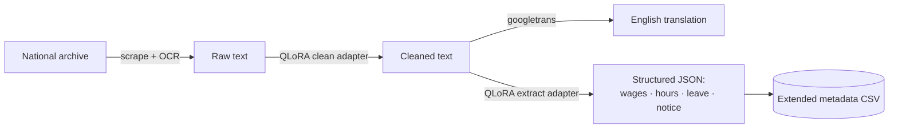

# Collective Bargaining Agreements — Web Scraping & Structuring


Scrapes, cleans, translates, and structures national Collective Bargaining Agreements from
government labor archives — Italy, Finland, and Spain — and fine-tunes an LLM to turn messy
scanned-document text into structured, queryable data.

## Pipeline



## What's in here

| Component | Status | What it does |
|---|---|---|
| [`scraping/italy_scraping/`](scraping/italy_scraping) | Production | Scrapes Italy's CNEL archive, extracts text from 7,500+ PDF/DOC/RTF agreements (OCR fallback for scans), machine-translates Italian → English |
| [`scraping/finland_scraping/`](scraping/finland_scraping) | Production | Scrapes Finland's Finlex archive (~200 sector agreements, ~500 document versions), OCRs Finnish text, machine-translates Finnish → English |
| [`finetune/`](finetune) | Production | QLoRA-fine-tuned Qwen2.5-7B pipeline that cleans OCR noise and extracts structured fields from the scraped text — [full writeup →](finetune/README.md) |
| [`scraping/spain_scraping/`](scraping/spain_scraping) | Early stage | Scraper for the Spanish equivalent archive; not yet run at scale |

## Results


*Active agreements by year, from the scraped Italian corpus (`italy_descriptives.ipynb`).*

Fine-tuning was evaluated against a zero-shot baseline (same base model, no adapter) to isolate
its actual contribution — full methodology in [`finetune/README.md`](finetune/README.md):

| Task | Zero-shot | Fine-tuned |
|---|---|---|
| Cleaning — CER, typical-difficulty docs | 0.015 | **0.010** (52.8% lower) |
| Extraction — JSON parse failure rate | 16.7% | **0%** |
| Extraction — avg. field F1 | 0.57 | **0.75** |

Adapters were then run over the full Italian corpus, producing a cleaned text corpus, an English
translation, and an extended metadata CSV with structured fields (sector, wage increases, weekly
hours, probation/notice periods, leave entitlements) for every agreement.

Cloud GPU access fell through mid-project, so the fine-tuning stack was rebuilt to run entirely
on local Apple Silicon (MLX) alongside the original CUDA build — both are maintained in parallel.

## Repository structure

```
├── scraping/
│   ├── italy_scraping/         # Scraper, OCR/text extraction, translation notebooks
│   │   ├── Italy_metadata.csv    # Core administrative database (7,500+ agreement records)
│   │   └── README_Italy           # Data dictionary / field reference
│   ├── finland_scraping/       # Scraper, OCR/text extraction, translation notebooks
│   │   ├── finland_metadata.csv  # Core administrative database (~200 agreements)
│   │   └── README_Finland         # Data dictionary / field reference
│   └── spain_scraping/         # Spain archive scraper (early stage)
├── finetune/                   # QLoRA cleaning + structured-extraction pipeline
│   ├── adapters/                 # Trained LoRA adapters
│   ├── output/                    # Cleaned corpus, translated corpus, extended metadata CSV
│   └── README.md                   # Full pipeline documentation, architecture, eval results
```

Raw/OCR'd/translated document assets (PDFs, `*_txts/`) are kept local-only, not committed —
they're regenerable from each `*_scraping/` folder's scraper/extractor/translator notebooks.

## Getting started

- **Scraping/OCR**: Python 3.12, Tesseract OCR on the system path (with the Finnish `fin`
  language pack for `scraping/finland_scraping/`), Poppler (for Finland's `pdf2image` step),
  `seleniumbase`/`selenium`, `pdfplumber`, `pytesseract`.
- **Fine-tuning pipeline**: separate CUDA and MLX requirements — see
  [`finetune/README.md`](finetune/README.md) for setup and per-stage usage.

## Data sources

- **Italy**: CCNLs as filed with CNEL (Consiglio Nazionale dell'Economia e del Lavoro), Italy's
  National Council for Economics and Labour.
- **Finland**: Collective agreements as filed with Finlex, Finland's official legislative and
  regulatory database.

Both are publicly available government archive data.
