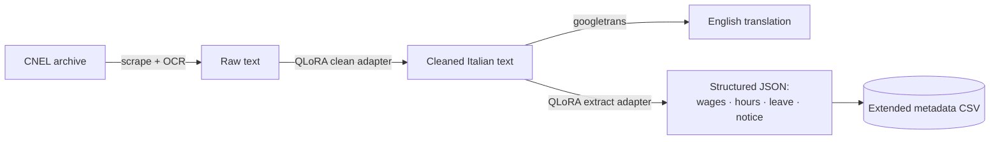
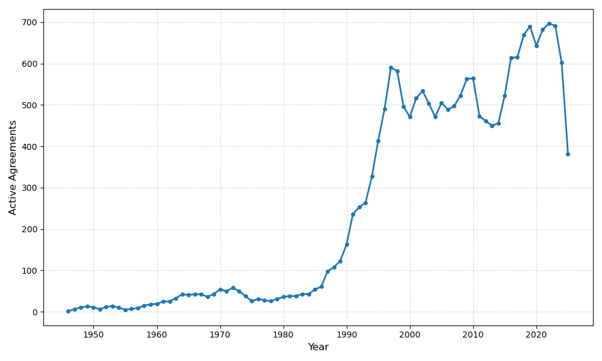

# Collective Bargaining Agreements — Web Scraping & Structuring


Scrapes, cleans, translates, and structures national Collective Bargaining Agreements (CCNLs)
from government labor archives — starting with Italy's CNEL archive — and fine-tunes an LLM to
turn messy scanned-document text into structured, queryable data.

## Pipeline



## What's in here

| Component | Status | What it does |
|---|---|---|
| [`italy_scraping/`](italy_scraping) | Production | Scrapes the CNEL archive, extracts text from 7,500+ PDF/DOC/RTF agreements (OCR fallback for scans), machine-translates Italian → English |
| [`finetune/`](finetune) | Production | QLoRA-fine-tuned Qwen2.5-7B pipeline that cleans OCR noise and extracts structured fields from the scraped text — [full writeup →](finetune/README.md) |
| [`spain_scraping/`](spain_scraping) | Early stage | Scraper for the Spanish equivalent archive; not yet run at scale |

## Results



*Active agreements by year, from the scraped corpus (`italy_descriptives.ipynb`).*

Fine-tuning was evaluated against a zero-shot baseline (same base model, no adapter) to isolate
its actual contribution — full methodology in [`finetune/README.md`](finetune/README.md):

| Task | Zero-shot | Fine-tuned |
|---|---|---|
| Cleaning — CER, typical-difficulty docs | 0.015 | **0.010** (52.8% lower) |
| Extraction — JSON parse failure rate | 16.7% | **0%** |
| Extraction — avg. field F1 | 0.57 | **0.75** |

Adapters were then run over the full corpus, producing a cleaned Italian text corpus, an English
translation, and an extended metadata CSV with structured fields (sector, wage increases, weekly
hours, probation/notice periods, leave entitlements) for every agreement.

Cloud GPU access fell through mid-project, so the fine-tuning stack was rebuilt to run entirely
on local Apple Silicon (MLX) alongside the original CUDA build — both are maintained in parallel.

## Repository structure

```
├── italy_scraping/          # Scraper, OCR/text extraction, translation notebooks
│   └── Italy_metadata.csv    # Core administrative database (7,500+ agreement records)
├── spain_scraping/          # Spain archive scraper (early stage)
├── finetune/                # QLoRA cleaning + structured-extraction pipeline
│   ├── adapters/              # Trained LoRA adapters
│   ├── output/                 # Cleaned corpus, translated corpus, extended metadata CSV
│   └── README.md                # Full pipeline documentation, architecture, eval results
├── README_Italy              # Data dictionary / field reference for Italy_metadata.csv
└── Italy CBAs Report Structure.pdf
```

## Getting started

- **Scraping/OCR**: Python 3.12, Tesseract OCR on the system path, `seleniumbase` /
  `pdfplumber` / `pytesseract`.
- **Fine-tuning pipeline**: separate CUDA and MLX requirements — see
  [`finetune/README.md`](finetune/README.md) for setup and per-stage usage.

## Data source

Italian CCNLs as filed with CNEL (Consiglio Nazionale dell'Economia e del Lavoro), Italy's
National Council for Economics and Labour — publicly available government archive data.
